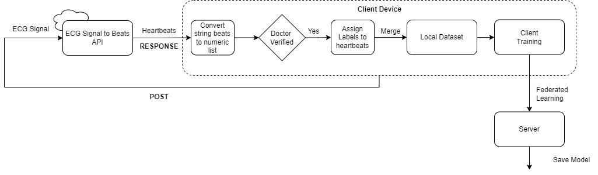

# API Instructions

### Create a conda environment with the requirements specified in the requirements.txt file

conda create --name <env-name> --file requirements.txt

### Activate the conda environment
conda activate <env-name>

### Navigate to ECG Processing API 
cd ECG_Processing_API

### Start the server
uvicorn main:app --reload

### POST ECG Signal
POST ECG Signal as list in the following URL, "http://127.0.0.1:8000/signals/"
(List length must be at least 500)
In response it'll provide a beats string

The API saves the signal in the "signals" table.
Extracted heartbeats gets saved in the "items" table.

## Post processing (Convert beats string to beats list)

### import function
from data_process.pre_n_post_process import beats_str_to_list

### Get processed beats
beats = beats_str_to_list(beats_json)

Go through the client.py file for a more detailed view