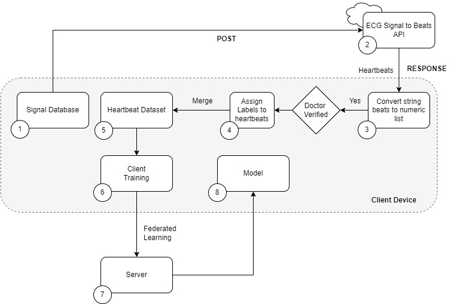

# Project Setup Instructions

## Setup Script

### Clone the repository
git clone https://github.com/ifran-rahman/Federated-ECG.git

### Create a conda environment with the requirements specified in the requirements.txt file
conda create --name <env-name> --file requirements.txt

### Activate the conda environment
conda activate <env-name>

## Activate ECG Processing API

### Navigate to ecg_processing_api
cd ecg_processing_api

### Run ECG Processing API server
uvicorn main:app --reload

## Activate Federated Learning
## Open seperate console to activate FL server 

### Navigate to server folder
ECG Classification/server

### Start the server
python server.py 

## Open seperate console to activate FL client 1 

### Activate the conda environment
conda activate <env-name>

### Navigate to client folder
cd ECG Classification/client

### Start client 1 
python client.py 

## Open seperate console to activate FL client 2 
### Repeat the exact same process as client 1 (here, we are using same client file for two clients)

