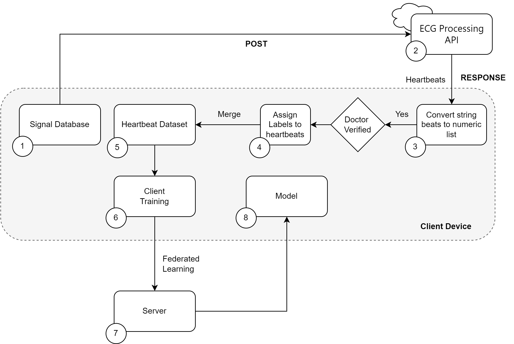

# Project Setup Instructions

## Setup Script

## Clone the repository

## Create a conda environment with the requirements specified in the requirements.txt file
conda create --name <env-name> --file requirements.txt

## Activate the conda environment
conda activate <env-name>

## Implementing API
cd ECG Classification

## Implementing Federated Learning

# Navigate to ECG Classification folder
cd ECG Classification

## Start the server
python server.py 

## Start client1 in a separate terminal
python client1.py 

## Start client2 in a separate terminal (here, we are using same client file for two clients).
python client1.py 

